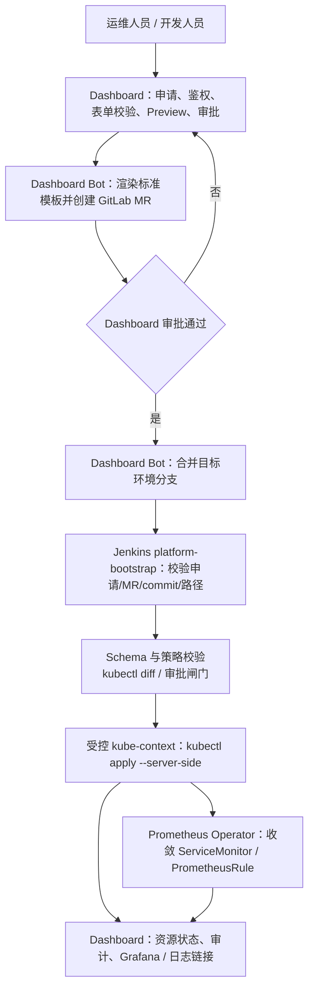
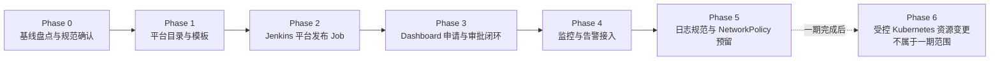
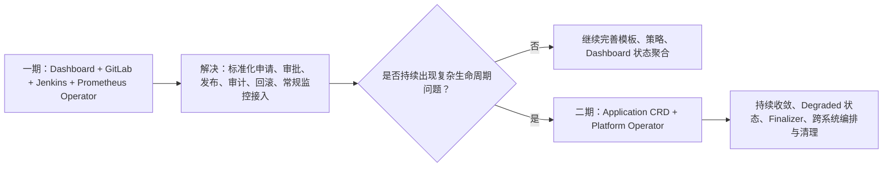

# 应用接入 / 环境开通落地方案（一期）

> 状态：Hash 监控资源受控合并与真实发布试点已验证；Dashboard 托管 MR 创建待实现
> 更新时间：2026-09-03
> 适用范围：Dashboard、Jenkins、GitLab Kubernetes YAML 仓库及各目标 Kubernetes 集群
>
> 入口原则：运维人员和开发人员通过 Dashboard 申请、审批与发布平台资源；不得手工修改 `k8s-yaml` 后自行发布。GitLab 保留为 Dashboard 系统身份生成的变更记录、Review 载体和期望状态仓库。

## 1. 结论与目标

一期采用 **Dashboard 作为环境开通控制面 + GitLab YAML 作为期望状态源 + Jenkins 作为发布执行器 + Prometheus Operator 作为监控对象控制器** 的组合。

**一期不引入 Argo CD，也不开发自研 Platform Operator。**

目标是将 Namespace、RBAC、资源配额、网络基线、监控/告警接入等重复运维操作标准化，并保留：

- 表单校验、权限与审批；
- GitLab MR 审查、版本记录、差异对比与可逆回滚；
- Jenkins 统一发布与执行记录；
- Prometheus Operator 对 `ServiceMonitor` / `PodMonitor` / `PrometheusRule` 的持续收敛；
- Dashboard 中的开通状态、审计记录及 Grafana / 日志跳转入口。

## 2. 一期职责边界

| 组件 | 一期负责 | 不负责 |
| --- | --- | --- |
| Dashboard | 多云/目标环境选择、申请表单、参数校验、权限校验、审批、生成变更、创建 GitLab MR、展示任务状态/审计、Grafana/日志链接 | 长期直接写入集群、指标采集、告警计算、全量部署编排 |
| GitLab `k8s-yaml` | 保存经过审批的 Kubernetes 期望状态；提供 commit/MR/Review/Diff/Revert | 主动同步集群 |
| Jenkins | 校验并向目标 `kube-context` 发布平台基线资源；记录构建与执行结果 | 持续检测集群漂移并自动纠偏 |
| Prometheus Operator | Watch 并收敛 `ServiceMonitor`、`PodMonitor`、`PrometheusRule` 等监控 CR | Namespace、RBAC、Quota、网络策略、日志采集器部署 |
| Prometheus / Alertmanager / Grafana / Loki | 指标抓取、规则计算、告警路由、可视化与日志查询 | 环境开通审批和资源编排 |

### 2.1 核心约束

1. **Git 已合并 YAML 是资源期望状态的唯一来源。** 平台资源不得由 Dashboard 长期直接 `kubectl apply`。
2. **同一个 Kubernetes 对象只能有一个发布者。** 不允许 Jenkins、Argo CD、Dashboard 或多个 Job 同时管理同一对象。
3. **Dashboard 是平台资源唯一业务入口。** 运维/开发人员不直接修改 `k8s-yaml` 的平台目录，也不能自行触发平台发布；Dashboard 服务身份创建变更并驱动审批和发布。
4. **业务 Workload 与平台基线分离。** 现有 `Deployment` / `StatefulSet` 保持由既有 Jenkins 流水线管理；平台开通 Job 只管理新增的基础资源。
5. **敏感值不得进入普通 YAML、MR 描述或 Dashboard 返回内容。** 通知 Webhook、Token、密码使用 Secret/外部密钥方案引用。

## 3. 目标发布链路



### 3.1 Webhook 是否必需

**不必需。** 一期可使用手动触发或 Jenkins 定时轮询 GitLab 分支/路径。

GitLab Push/Merge Event -> Jenkins Webhook 仅用于在 MR 合并后立即触发 Job，属于后续体验增强。Webhook 不承担审批、校验、发布权限或漂移治理职责。

## 4. 仓库与目录约定

现有实际 Workload YAML 仓库：

- 本地路径：`/Users/liuzelin/gitlab/kylin-script/k8s-yaml`
- Hash 测试环境分支示例：`hash-jenkins`

建议新增平台资源专用目录，不自动修改现有 `deployments/` 下业务 Workload：

```text
k8s-yaml/
├── deployments/                         # 既有 Jenkins 业务发布管理，保持不变
├── monitoring/                          # 存量监控资源；逐步迁移/归类
└── platform/
    ├── templates/                       # 经评审的标准模板（仅平台维护）
    └── environments/
        └── hash/
            └── apps/
                └── <app-id>/
                    ├── namespace.yaml
                    ├── resourcequota.yaml
                    ├── limitrange.yaml
                    ├── serviceaccount.yaml
                    ├── role.yaml
                    ├── rolebinding.yaml
                    ├── networkpolicy.yaml
                    ├── servicemonitor.yaml       # 可选
                    └── prometheusrule.yaml       # 可选
```

> 可视现有仓库规范选择 Kustomize；若使用，建议每个 `<app-id>` 目录增加 `kustomization.yaml`，由 Job 只发布目标目录。

### 4.1 资源归属

| 类别 | 一期发布者 | 说明 |
| --- | --- | --- |
| Deployment / StatefulSet / Service / Ingress（存量） | 现有业务 Jenkins Pipeline | 不在本项目中迁移，避免双写 |
| Namespace / ResourceQuota / LimitRange | `platform-bootstrap` Jenkins Job | Dashboard 模板生成并通过 MR 审批 |
| ServiceAccount / Role / RoleBinding | `platform-bootstrap` Jenkins Job | 默认最小权限，不创建宽泛 `ClusterRoleBinding` |
| NetworkPolicy | 一期仅保留模板/占位，不发布 | 当前集群不限制服务出网；后续启用时需单独设计和灰度 |
| ServiceMonitor / PodMonitor / PrometheusRule | `platform-bootstrap` Jenkins Job 发布，Prometheus Operator 收敛 | 必须符合目标集群 selector/label 约定 |
| 日志采集 Agent | 集群平台统一管理 | 应用接入只补充 labels、stdout/stderr 规范与跳转链接 |

## 5. Dashboard 功能拆分

### 5.1 新菜单与页面

新增：**应用接入 / 环境开通**。

一期至少包括：

1. 选择目标环境（映射现有环境配置和 `kubeContext`）；
2. 填写应用标识、Namespace、所属团队/负责人；
3. 选择资源规格档位（CPU/Memory Request/Limit、Quota）；
4. 选择 RBAC 标准角色；
5. 展示 NetworkPolicy 规划占位（一期不可配置、不可发布）；
6. 配置监控接入（Service label、port、metrics path、采集间隔）；
7. 选择标准告警规则包；
8. Preview：展示渲染后的资源清单与差异；
9. 提交审批、展示 GitLab MR、Jenkins Job 与最终集群状态；
10. 提供 Grafana Dashboard、Prometheus Targets、Loki/日志查询跳转。

### 5.2 Dashboard 后端职责

- 根据 `X-Target-Environment` / 当前环境配置确定 GitLab 项目、目标分支、平台目录和 Jenkins Job 参数；
- 只接受白名单模板参数，禁止用户提交任意 YAML；
- Dashboard 使用专用 GitLab Bot 身份创建 feature branch 和 MR；普通运维/开发账号对 `platform/` 路径无直接写权限；
- 审批通过后仅允许 Dashboard Bot 合并目标环境分支；禁止用户绕过 Dashboard 直接推送目标环境分支；
- 保存申请编号、申请人、审批人、目标环境、commit SHA、MR URL、Jenkins URL、执行结果及资源清单摘要；
- 读取 Jenkins/集群状态用于展示，但不绕过 Git/MR 直接创建平台资源。

## 6. Jenkins `platform-bootstrap` Job

新增独立 Job，不修改或替换现有业务流水线。

### 6.1 输入

- GitLab repository / branch / commit SHA；
- 目标环境与受控 `kube-context`；
- 目标路径：`platform/environments/<env>/apps/<app-id>/`；
- Dashboard 申请编号（用于审计关联）。

### 6.2 执行步骤

1. 校验 Job 参数、环境与路径白名单，以及 Dashboard 申请编号、审批状态、GitLab MR/commit 关联关系；
2. checkout 指定 commit SHA，禁止以浮动工作区内容发布；
3. YAML schema 校验（推荐 `kubeconform`）；
4. 策略校验：Namespace 命名、标签、Quota 上下限、禁止高危 RBAC、监控 label 等；
5. 执行 `kubectl diff`，保存差异至构建产物；
6. 通过审批闸门后执行 `kubectl apply --server-side`；
7. 等待并检查关键资源：Namespace Active、Quota/LimitRange/RBAC 存在；对监控资源检查 CR 已创建；
8. 输出资源结果、commit SHA、Job URL；Dashboard 写入审计记录。

### 6.3 发布权限

- Jenkins 使用专用 ServiceAccount / 凭据，按目标环境与资源类型最小化授权；
- 尽量将权限收敛至受管 Namespace；涉及创建 Namespace 的权限单独授予，不与常规业务发布凭据混用；
- 平台 Job 不应拥有不受限制的 cluster-admin 权限。

## 7. Prometheus Operator 接入前置核验

每个目标集群在接入前必须确认：

1. Prometheus Operator 与目标 Prometheus 实例已部署并健康；
2. `serviceMonitorSelector`、`serviceMonitorNamespaceSelector`、`ruleSelector` 的实际匹配规则；
3. 标准 label，例如仓库现有规则使用的 `release: kube-prometheus-stack`、`prometheus: prometheus`；
4. `ServiceMonitor` 的 Service selector、端口名称、metrics path（例如 `/actuator/prometheus`）与真实服务一致；
5. Alertmanager 路由、receiver、告警分组/抑制规则已配置；
6. Prometheus Target 显示 UP 后，才视为“监控接入成功”。

> `ServiceMonitor` / `PrometheusRule` 成功 apply 不等于监控有效。必须检查 Prometheus Targets、规则加载和一次测试告警的路由结果。

## 8. 分阶段实施顺序与验收



### Phase 0：基线盘点与规范确认

- [ ] 为每个 `kube-context` 建立环境映射：GitLab 分支、路径、Jenkins 凭据、监控 namespace/selector、Grafana/Loki 链接；
- [x] 确认 Hash 试点 Prometheus Operator 实例及 CR selector；
- [ ] 梳理现有 RBAC、监控、日志规范并形成可复用 profile；NetworkPolicy 仅记录后续调研项；
- [ ] 检查存量 YAML 中是否有 Webhook URL、Token、密码等敏感信息，并制定迁移/轮换计划。

**验收：** 完成环境配置清单，且选定一个非生产环境与低风险应用作为试点。

### Phase 1：GitLab 平台资源目录与模板

- [ ] 创建 `platform/templates`、`platform/environments/<env>/apps/<app-id>` 目录规范；
- [ ] 实现 Namespace、ResourceQuota、LimitRange、最小 RBAC 模板；
- [ ] 定义统一 labels/annotations、命名及资源规格档位；
- [ ] 通过 MR Review 确定首版模板。

**验收：** 一个示例应用能通过 MR 看到完整、可读、可审查的 YAML Diff。

### Phase 2：Jenkins 平台发布 Job

- [ ] 新建 `platform-bootstrap` Job；
- [ ] 实现参数白名单、指定 commit 发布、schema/policy/diff 校验；
- [x] 配置 Hash 试点最小权限的监控发布凭据；
- [ ] 输出结构化发布结果，供 Dashboard 关联展示。

**验收：** 在试点环境，从已合并 MR 的指定 commit 成功创建 Namespace、Quota、LimitRange 与基础 RBAC；失败时不影响现有业务 Workload。

### Phase 3：Dashboard 申请与审批闭环

- [ ] 增加“应用接入 / 环境开通”菜单、表单和 Preview；
- [ ] 对接 GitLab 创建 branch/MR；
- [ ] 对接审批与 Jenkins Job 触发/状态回读；
- [ ] 建立审计记录与 Grafana/日志入口。

**验收：** 试点完整走通：申请 -> 审批 -> MR -> Jenkins -> 集群资源 -> Dashboard 可追溯状态。

### Phase 4：监控与告警接入

- [ ] 接入 `ServiceMonitor` / `PodMonitor` 模板；
- [ ] 接入少量标准 `PrometheusRule`（如 TargetDown、CrashLoop、重启异常、资源接近配额）；
- [ ] 验证 Prometheus Target、Rule 载入与 Alertmanager 路由；
- [ ] 加入 Grafana / Loki 下钻链接。

**验收：** 真实目标为 UP；触发一次非生产测试告警，可收到且可恢复；Dashboard 链接可定位到对应指标和日志。

### Phase 5：日志规范与 NetworkPolicy 预留

- [ ] 验证集群级日志采集、应用 labels 和日志检索链路；
- [ ] 保留 NetworkPolicy 模板、字段和目录约定，但**一期不生成、不审批、不发布任何 NetworkPolicy**；
- [ ] 后续如启用出网/东西向访问治理，单独立项，先完成连通性梳理、预览与试点灰度。

**验收：** 日志可按应用/环境检索；一期没有因 NetworkPolicy 引入任何业务连通性变更。

### Phase 6：受控 Kubernetes 资源变更（不属于一期范围）

> 前置条件：一期“应用接入 / 环境开通”闭环已稳定运行；本阶段单独立项、单独评审后实施，**不纳入一期交付与验收范围**。

目标是将现有 `k8s-yaml` 中除应用开通基线外的受管资源修改，逐步接入同一条 Dashboard -> GitLab MR -> Jenkins -> Kubernetes 的受控发布链路；Dashboard 仍是唯一业务入口，GitLab 仅作为系统生成的期望状态、Review 与审计仓库。

实施顺序：

1. **先接入低风险、命名空间级资源**：应用 ConfigMap 的白名单键、Service、Ingress、HPA、PDB、ServiceMonitor、PrometheusRule；
2. **再接入共享服务资源**：例如 `monitoring/`、日志采集、共享中间件配置；必须使用独立的审批策略和专用 Jenkins Job；
3. **最后评估集群级高危资源**：例如 CRD、ClusterRole、Webhook、Admission 配置、Ingress Controller 或网络底座；不提供自助化修改，要求双人审批、维护窗口与明确回滚预案。

本阶段必须新增以下治理能力：

- **资源所有权登记**：记录资源的 GitLab 路径/分支、当前发布者、Jenkins Job 和责任团队，避免被已有业务流水线覆盖；
- **变更策略矩阵**：按环境、资源类型、路径和操作（create/update/delete）定义发起人、审批人、风险级别、发布 Job、维护窗口与删除限制；
- **受控变更方式**：优先白名单表单模板；复杂低频变更使用受限 Patch；禁止任意 YAML 自助发布；
- **并发与版本保护**：基于 Git commit 校验后生成 MR；发现目标资源已被其他 MR 修改时拒绝盲目覆盖并要求重新预览；
- **删除分级**：`delete` 与 `update` 使用不同权限；Namespace、PVC、Secret、CRD、共享 ConfigMap 等删除/替换必须单独审批，并具备备份或回滚方案。

**验收：** 选定一个低风险命名空间级资源完成 Dashboard 申请 -> 审批 -> GitLab MR -> Jenkins 发布 -> 集群验证 -> Dashboard 审计与回滚的端到端试点；全程不允许用户直接修改平台受管路径或绕过 Dashboard 触发发布。

## 9. 回滚与失败处理

| 场景 | 处理方式 |
| --- | --- |
| YAML/MR 校验失败 | 阻断合并/发布，修正后重新提交 |
| Jenkins 发布失败 | Job 标记失败，保留构建日志和 diff；修正 YAML 后新建 MR/commit |
| 后续启用 NetworkPolicy 后网络不通 | revert 对应 NetworkPolicy 变更并重新执行平台 Job；禁止手工长期修改集群替代回滚 |
| 监控对象创建但 Target Down | 检查 Service selector、端口名、路径和 Prometheus selector；不直接认定监控完成 |
| 需要撤销资源 | 优先 revert MR 并由受控 Job 执行；删除 Namespace、数据库、云资源等不可逆操作必须单独审批 |

## 10. 后续演进：何时引入 Argo CD / Platform Operator

### 10.1 Argo CD

只有满足以下需求时再引入：需要持续检测并自动/半自动纠正手工集群变更（drift），或需要 Git 合并后的常驻同步控制器。

引入策略：**先只管理 `platform/` 路径**，不要立即迁移现有 `deployments/`；Jenkins 继续负责构建和既有 Workload 发布。每个 Kubernetes 对象仍必须只有一个管理者。

### 10.2 Platform Operator

满足以下任意多项后再评估：

- 单次开通需要协调 5 类以上资源且存在复杂依赖/状态机；
- 涉及异步外部系统（DNS、数据库、云 IAM、工单、租户）；
- 平台标准需要持续自动修复漂移；
- 环境和团队规模使 YAML 模板/MR 管理成为明显瓶颈。

届时 Dashboard 保持申请与治理入口，升级为创建 `Application` CR；Platform Operator 负责 CR 到具体平台资源的持续编排。

## 11. Platform Operator 演进决策

### 11.1 推荐分界



一期的受控发布链路用于解决“如何规范地申请、审批、发布和追溯 Kubernetes 资源变更”；Platform Operator 用于解决“如何持续协调一个应用的复杂生命周期”。两者互补，不互相替代。

| 真实场景 | 一期能力边界 | 是否需要 Platform Operator |
| --- | --- | --- |
| 新服务交付 | 可通过 Dashboard 模板、审批、GitLab MR、Jenkins 一次性创建标准资源；不提供持续 Controller 收敛 | 暂不需要 |
| 服务扩容 | HPA 本身持续控制副本；Dashboard 可受控调整 HPA 策略 | 通常不需要 |
| 监控缺失 | 可按标准规则包创建 `ServiceMonitor` / `PrometheusRule`；由 Prometheus Operator 收敛 | 暂不需要 |
| 安全配置漂移 | Jenkins 发布后不能持续发现或自动修复手工删除/修改 | 若需自动纠偏，先评估 Argo CD/Flux；若需按应用标准判断并标记 Degraded，再评估 Platform Operator |
| 删除服务 | 可走高风险审批与受控 Job；不具备复杂外部依赖的可靠顺序清理、失败重试与阻断 | 需要后续 Platform Operator 或等价状态机能力 |
| 故障定位 | 可聚合 MR、Jenkins、集群资源、Prometheus Target、Grafana/Loki 链接 | 若需要 `Application.status.conditions` 作为跨系统统一事实，需要 Platform Operator |

### 11.2 Platform Operator 立项必要条件

不因“想使用 Operator”而创建 Operator。建议同时满足以下 **至少 3 项**，且已通过一期试点确认模板和 Jenkins 编排难以长期维护时，再立项设计 `Application` CRD 与 Platform Operator：

1. 新服务交付需要协调 **5 类以上资源**，且存在明确资源依赖顺序；
2. 涉及 DNS、云 IAM、数据库、Secret、工单或租户等**外部异步系统**；
3. 服务删除必须可靠执行依赖清理、失败重试、阻断删除和人工介入；
4. 需要持续发现/修复应用标准配置漂移，或以 `Degraded` 明确暴露不合规状态；
5. Dashboard 状态聚合不足，需要 `Application.status.conditions` 成为应用生命周期的统一事实；
6. 同类流程高频发生，模板 + GitLab MR + Jenkins 编排已成为明显的维护瓶颈；
7. 需要跨集群或跨云资源协调同一个应用的长期生命周期。

立项前应先明确：CRD 的用户意图边界、资源所有权、Finalizer 删除语义、外部 API 重试/幂等、状态条件定义、人工介入出口，以及与 GitLab/Jenkins/Argo CD 的单一发布者边界。

### 11.3 落地顺序

1. **一期先行**：完成本方案 Phase 0–5，以 1–2 个真实新服务在非生产环境验证申请、审批、MR、Jenkins、集群资源、监控和审计闭环；
2. **一期后增强**：优先完成资源所有权登记、Phase 6 受控 Kubernetes 资源变更、HPA 策略入口与标准监控规则包；
3. **漂移治理优先选型**：若痛点只是 Git 与集群资源漂移，优先评估 Argo CD/Flux，不因该单一需求直接开发 Platform Operator；
4. **评估复杂生命周期**：收集试点中的跨资源依赖、外部系统、删除清理、状态追踪和人工介入数据；
5. **二期按门槛立项**：只有满足上述必要条件后，再设计 `Application` CRD + Platform Operator，并以一个高价值复杂场景试点；
6. **渐进接管**：Operator 只接管明确归属的资源；Dashboard 保持入口与审批治理，GitLab 保持审计/期望状态边界，避免与 Jenkins、Argo CD 或其他 Controller 双重管理同一对象。

## 12. Hash 试点实施进度与交接基线（2026-09-01）

> 本节记录已执行的 Hash 非生产试点基础设施变更、验证证据与尚未完成项，供后续实施者交接使用。**不记录 Token、Jenkins URL、认证信息、kubeconfig 内容、数据库密码或其他明文敏感数据。**具体命令、Token 轮换与故障处置应另建受控 Runbook。

### 12.1 已确认的环境与监控契约

| 项目 | 已确认值 / 结论 |
| --- | --- |
| Dashboard 环境映射 | `hashex` 映射到 `kubeContext: hash`；运行时环境配置以 DB 为优先级，本地、被 Git 忽略的 `environments.json` 仅为回退配置 |
| Hash kube-context | `hash`，对应 EKS Cluster `arn:aws:eks:ap-east-1:290368114919:cluster/hash` |
| Prometheus Operator | 已安装；版本为 `v0.90.1`，运行于 `monitoring` Namespace |
| Prometheus 实例 | `monitoring/kube-prometheus-stack-prometheus` |
| 发现标签 | `ServiceMonitor` 与 `PrometheusRule` 必须带 `release: kube-prometheus-stack` |
| 监控 CR Namespace | Prometheus 的 ServiceMonitor/Rule Namespace selector 未限制；平台试点使用独立 `platform-monitoring`，不写入共享 `monitoring` |
| 业务 Workload 边界 | 业务 Workload 继续由既有 Jenkins 流水线发布到共享 `default`；平台一期不拥有或修改 `default` 中的 Workload、RBAC、Quota、LimitRange、Service 或 ConfigMap |

### 12.2 已创建的集群资源

| 资源 | Namespace | 用途 / 边界 |
| --- | --- | --- |
| `Namespace/platform-system` | 集群级 | 平台发布身份的隔离 Namespace |
| `Namespace/platform-monitoring` | 集群级 | 存放平台受控的 `ServiceMonitor`、`PodMonitor`、`PrometheusRule`，避免写入共享 `monitoring` |
| `ServiceAccount/platform-bootstrap` | `platform-system` | `platform-bootstrap` Jenkins Job 专用发布身份 |
| `Role/platform-bootstrap-monitoring-writer` | `platform-monitoring` | 仅允许监控 CR 的 `get/list/watch/create/update/patch` |
| `RoleBinding/platform-bootstrap-monitoring-writer` | `platform-monitoring` | 将上述 Role 绑定到 `platform-system/platform-bootstrap` |
| `Secret/platform-bootstrap-jenkins-token` | `platform-system` | Jenkins 专用 kubeconfig 的 ServiceAccount Token 来源；内容不得导出、打印或提交仓库 |

### 12.3 已验证的最小权限矩阵

| 操作 | 结果 | 说明 |
| --- | --- | --- |
| 在 `platform-monitoring` 创建 `ServiceMonitor` | 允许 | 一期监控接入所需 |
| 在 `platform-monitoring` 更新/patch `PrometheusRule` | 允许 | 一期标准规则包所需 |
| 删除 `platform-monitoring` 中的监控 CR | 拒绝 | 一期默认不开放删除；删除需单独设计审批与权限 |
| 在 `default` 创建 `Deployment` 或 `Role` | 拒绝 | 防止平台 Job 影响现有业务 Workload 或共享 RBAC |
| 在 `monitoring` 创建监控 CR | 拒绝 | 防止直接修改共享监控对象 |
| 读取 `platform-system` Secret | 拒绝 | 发布身份不具备 Secret 读取权限 |
| 创建 Namespace | 拒绝 | 一期不开放 Namespace 自助创建 |

### 12.4 已验证的受控发布闭环（2026-09-03）

Hash 监控资源试点已验证完整闭环：Dashboard 申请与双人审批 → 显式“确认合并并生成最终 Diff” → Dashboard Bot 合并绑定 MR → 回读 `merged_at` 与 merge commit SHA → Jenkins Preview → 一次性授权的真实 Apply。批准本身不修改 GitLab；真实 Apply 仅接受已合并 SHA 的成功最终 Diff。

Jenkins 仅从经 GitLab 回读确认的不可变 merge commit 生成源码树，并且只允许 `k8s-yaml/platform/environments/hash/apps/<appId>/monitoring/` 下的 `ServiceMonitor`、`PodMonitor`、`PrometheusRule` 进入 `kubeconform`、Kubernetes server-side dry-run/diff 与 apply。MR 目标分支、请求标记、绑定 SHA、受控路径和资源白名单任一不匹配均 fail-closed。

Dashboard 保存 MR、source/merge commit、合并时间、Preview/Apply 构建记录、无变更 Diff 与审计事件；真实 Apply 仅允许非申请审批人确认，短时授权在 `kubectl apply` 前原子消费。试点 `ServiceMonitor` 已经由 Jenkins #36 Preview 与 #37 Apply 验证成功。

### 12.5 当前过渡模式：人工创建 MR，Dashboard 绑定与合并

当前申请人仍需在 GitLab 创建受控分支、提交 YAML、创建目标为 `hash-jenkins` 的 MR，然后在 Dashboard 填写 MR IID 与 HEAD SHA。Dashboard 在提交、合并、Preview 和 Apply 各阶段重新校验绑定关系，因此手工创建并不允许绕过审批或发布门禁；但跨系统复制申请 ID、MR IID、SHA 仍有可用性与错绑风险。

### 12.6 下一阶段：Dashboard 托管 MR 创建（推荐）

应将“生成受控变更”纳入 Dashboard：申请表单收集资源规格，后端以模板生成限定 YAML，使用专用 GitLab Bot 从 `hash-jenkins` 创建 `platform/<request-id>` 分支、仅写入该申请对应的 `k8s-yaml/platform/.../monitoring/` 文件，并创建包含 `Dashboard-Request-ID` 的 MR。Dashboard 将自动保存 MR IID 与 source SHA，申请人无需再手填。

实现边界：

- Bot 仅可创建受控前缀分支、写入申请绑定目录、创建目标为 `hash-jenkins` 的 MR；不得提供任意路径/任意内容提交能力；
- 模板输入需做字段级白名单、长度和资源策略校验，生成 YAML 后再进行 schema/policy 校验；
- 提交失败必须保持草稿或可重试状态，不能产生“已提交但无 MR”的半完成申请；
- 仍保留 GitLab MR 作为 Review 与版本记录载体；审批、显式合并、Preview、Apply 的职责边界不变；
- 对复杂或非模板化变更，可暂保留“外部 MR 绑定”作为受控例外，并强制相同的 MR/SHA/路径校验。

### 12.7 后续验收重点

- 用全新申请验证：批准后 MR 仍为 Open，只有“确认合并并生成最终 Diff”触发 Bot 合并；
- Dashboard 保存并展示 MR、source/merge commit、Jenkins 构建、一次性授权消费与集群资源结果；
- Jenkins 仅发布已经合并到目标分支的不可变 SHA；
- 预发/生产分支启用保护规则，限制 Dashboard Bot 为自动合并身份，并按团队策略启用 pipeline、讨论和审批门禁；
- Apply 后继续验证 Prometheus Target/规则/告警链路；仅 `kubectl apply` 成功不代表监控接入完成。

## 13. 文档维护约定

本文档是**方案设计、职责边界、实施顺序和验收标准**的基线，不承载环境特定的实际命令、凭据、URL 或一次性故障处置记录。

开始实施时，应按组件/环境另建 Runbook（例如 `docs/runbooks/`），记录已评审的具体执行命令、前置检查、回滚命令、权限申请、验证证据与值班处置步骤；Runbook 必须引用本文档，并随实现变更同步维护。

## 14. 实现完成定义（Definition of Done）

一期完成必须同时满足：

- 运维人员和开发人员只能经 Dashboard 创建、审批和发布平台资源；
- Dashboard 不能绕过 GitLab MR 直接发布平台资源；
- GitLab `platform/` 路径受保护：仅 Dashboard Bot 可写入/合并，普通账号无直接写权限；
- Jenkins 只执行具备 Dashboard 申请编号、有效审批状态和关联 MR/commit 的平台发布请求；
- GitLab 中可追溯每次开通的资源变更、审批、commit 和回滚；
- Jenkins 仅以指定 commit 和受控路径发布，并完成 schema/policy/diff 校验；
- 新增资源与存量业务 Workload 没有双发布者；
- Prometheus Operator 实际发现并抓取接入对象，标准规则和告警路由验证通过；
- Dashboard 可关联显示申请、MR、Jenkins、资源状态与观测链接；
- 敏感通知凭据未以明文写入新 YAML 或 Dashboard 审计数据。
