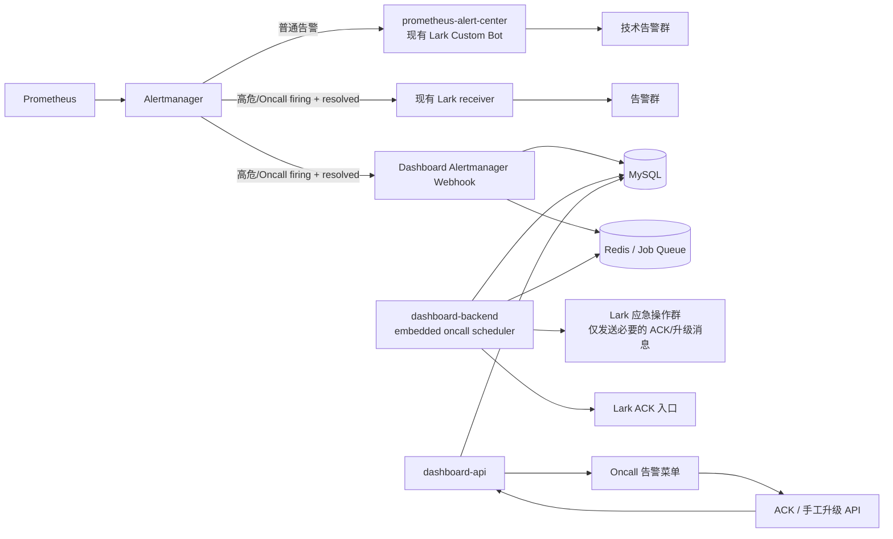

# Prometheus / Alertmanager / Lark Oncall 接入方案

> 状态：Alertmanager 接收、状态同步、ACK、审计和页面能力已完成；Hotline 电话能力暂停，生产接入前仍需完成 Alertmanager 双路由和 Webhook 验证
> 更新时间：2026-09-24
> 适用范围：`dashboard`、目标 EKS 集群 `mgbx`、Prometheus、Alertmanager、Lark 技术告警群与 Hotline Bot

## 1. 结论

本方案可行，推荐将 Oncall 能力接入现有 `dashboard` 仓库，新增独立菜单和模块，不修改现有独立链路探测功能，也不替换当前普通告警 Bot。首期继续保持现有 backend + frontend 两个 Node/PM2 进程；Worker 只保留为后续可选的独立运行入口。

当前菜单定版为 **Alertmanager 告警响应中心**：Dashboard 负责接收、记录、通知、ACK、审计和展示告警生命周期；Prometheus/Alertmanager 负责判断告警是否恢复。Alertmanager 应将 firing/resolved 事件同时扇出到现有 Lark receiver 和 Dashboard Webhook，Dashboard 不再针对同一 resolved 事件重复发送恢复消息。Hotline 电话接口不可用期间不启用电话升级，也不以电话能力作为菜单可用性的前置条件。

最终采用：

```text
Dashboard 单仓库
  ├── dashboard-api       管理、查询、ACK、配置
  ├── dashboard-backend   接收事件、定时升级、发送通知/电话（首期内嵌）
  └── dashboard-oncall-worker  可选独立运行入口（扩容或隔离时启用）
```

### 1.1 对本次想法的确认

| 想法 | 结论 | 边界 |
| --- | --- | --- |
| 新建菜单，不复用现有运维菜单 | 可行，推荐 | 新建“Oncall 告警”菜单及权限资源；不影响现有菜单 |
| 接入集群 Prometheus / Alertmanager | 可行，推荐 | 接收 Alertmanager Webhook 事件；不由 Dashboard 自己计算 PromQL 告警 |
| 不使用独立链路探测集群服务 | 可行 | 现有站点/线路探测链路继续独立运行，本项目只新增 Kubernetes 告警域 |
| 使用新建 Hotline Bot | 可行，推荐 | 只负责升级电话等能力；与当前告警链路使用的 Lark Custom Bot 隔离 |
| 代码放入 `dashboard` | 可行，推荐 | 代码同仓库，运行时 API 与 Worker 分离，避免定时任务和 API 相互影响 |

## 2. 设计原则与非目标

### 2.1 设计原则

1. **Alertmanager 是告警事件入口和路由中心。** Dashboard 不主动轮询 Prometheus 指标来判断告警。
2. **Prometheus 负责采集和规则计算，Alertmanager 负责分组、抑制、路由。** Oncall 服务负责状态、ACK、审计和页面展示；外部消息由 Alertmanager receiver 或明确的应急通知通道负责。
3. **现有链路保持稳定。** 当前 `Alertmanager → prometheus-alert-center → 现有 Lark Bot` 不直接替换；普通告警可继续走原链路。
4. **高危告警使用独立 Oncall 路由。** 高危告警由 Alertmanager 扇出至 Dashboard Webhook 和现有 Lark receiver；Dashboard backend 负责状态、ACK、审计和必要的应急操作，独立 Worker 作为后续扩展选项。
5. **所有升级动作幂等、可审计、可重试。** 不能因为 Worker 重启、API 多副本或重复 Webhook 重复打电话。
6. **敏感配置只放 Secret/密钥存储。** Lark App 凭据、Webhook、电话服务凭据不得进入代码、普通 YAML、日志或页面返回值。
7. **负责人统一承接后续升级。** 不单独建模 CTO 角色；L2 超时后的升级目标归入“负责人”范围，由值班配置决定具体人员。

### 2.2 非目标

- 不改造现有站点、线路探测告警模块。
- 不让 Dashboard 取代 Prometheus、Alertmanager 或 Grafana。
- 第一阶段不强制实现复杂排班、电话重试和多级升级；先打通事件记录、分流和 ACK。
- 不把可靠的超时升级逻辑仅放在 API 进程内。

## 3. 目标架构



### 3.1 两类告警路径

| 告警类型 | 首期路径 | 说明 |
| --- | --- | --- |
| 普通告警 | Prometheus → Alertmanager → 现有 Alert Center → 技术告警群 | 保持现有行为，避免迁移风险 |
| 高危告警 | Prometheus → Alertmanager →（现有 Lark receiver + Dashboard Webhook）→ Dashboard 状态/ACK/审计 | Alertmanager 同时负责 firing/resolved 扇出；Dashboard 不重复发送 resolved |

高危告警建议使用统一标签 `risk_level: high`，不要依赖告警文本关键词。高危规则至少应覆盖资金、充值、提现、入侵、AK 泄露、交易引擎等业务风险；具体清单在 Phase 0 确认。

Phase 1 的临时测试分流可以先匹配现有 `severity="critical"`，并配置两个并行 receiver：现有 Lark receiver 与 Dashboard Webhook；两个 receiver 均设置 `send_resolved: true`。这样现有群通知不被替换，Dashboard 可同步恢复状态，也不会重复发送 resolved。由于当前 critical 规则包含监控基础设施和节点类告警，生产接入前仍需建立 alertname 白名单或补充业务风险标签。

### 3.2 Worker 运行方式

首期继续保持现有 `backend + frontend` 两个 Node/PM2 进程，不额外启动一个后端服务。Oncall Webhook、状态机和定时升级作为 Dashboard backend 中的独立 Nest module/provider 运行，并由配置开关控制：

```text
ONCALL_ENABLED=true
ONCALL_SCHEDULER_ENABLED=true
```

这样可以减少部署组件，但必须满足以下条件：

- 所有升级动作使用 MySQL 唯一键、事务租约或等价分布式锁，保证重复 Webhook、backend 重启和未来多副本不会重复通知/拨号；
- 定时任务不能依赖单进程内存状态，待处理事件和下一次执行时间必须持久化；
- Webhook 接收和外部 Lark/Hotline 调用必须异步解耦，外部接口失败不能阻塞 API 请求；
- 当 backend 扩容、升级任务量增加或需要独立发布/重启时，再启用 `dashboard-oncall-worker` entry。独立 Worker 是扩展选项，不是首期硬性依赖。

### 3.3 Redis / Job Queue 边界

Oncall 可以使用与现有 Redis 实例相同的物理 Redis，但必须使用独立 logical DB、专用 key prefix 和独立连接配置，例如 `ONCALL_REDIS_DB` 与 `oncall:` prefix。不能直接复用某个环境现有 Redis DB 的连接配置。

使用 logical DB 前必须在 Phase 0 确认：

- Oncall 与目标 Redis 位于同一网络且账号具备 `SELECT`/队列所需权限；
- Redis 服务确实支持 logical DB，且当前部署没有使用 Redis Cluster（Cluster 不支持按 DB 隔离）；
- 备份、容量、TTL、ACL 和故障恢复策略不会与业务 Redis 相互影响。

logical DB 不是强安全边界，生产推荐独立 Redis 实例或 ACL 用户；如果首期只使用 MySQL 租约锁而不引入队列，可以暂时不新增 Redis 依赖。

### 3.4 Webhook 网络入口

当前阶段采用 **Internal Application Load Balancer（ALB）**，暂不引入 NLB。Webhook 复用 Dashboard backend 的 `:3000`，但由独立 Internal ALB、安全组、Target Group 与精确路径规则构成边界：

```text
Alertmanager Pod
  → Internal ALB（HTTPS / 专用 DNS）
  → Target Group（Dashboard EC2:3000）
  → Dashboard backend（仅由该 ALB 转发 /api/oncall/alertmanager）
```

实施约束：

- ALB 使用内部 scheme，只选择同 VPC 可达子网；
- ALB Security Group 仅允许 `mgbx` EKS 来源访问监听端口；
- EC2 Security Group 仅允许 ALB Security Group 访问 TCP 3000；
- Target Group 使用 EC2 私有地址/实例目标，健康检查使用独立的 `/api/oncall/health`，不能用 Webhook POST 路径；
- Internal ALB 的默认规则固定返回 `404`，只转发 `/api/oncall/alertmanager`；面向用户的 Dashboard ALB 对同路径固定返回 `404`；
- Alertmanager 使用 Secret 注入的 Bearer Token 或 mTLS，不能把 Secret 写入普通 ConfigMap；
- NLB 只有在后续明确需要 TCP/TLS 透传、固定 IP 或源 IP 保留时再评估。

ALB、安全组、证书和 DNS 已于 2026-09-22 创建：`oncaaa.pree.mg56.net` → Internal ALB，HTTPS 仅允许 `mgbx` EKS 受管工作负载安全组进入，ALB 再访问 Dashboard EC2 `:3000`。在完成健康检查和从 Alertmanager Pod 到 ALB 的连通性验证前，不切换生产 Alertmanager route。

## 4. Hotline Bot 可行性与前置条件

新建 Hotline Bot 与当前告警 Bot 分离是合理的安全和运维边界，但“已创建 Bot”不等于链路已经可调用。实施前需要验证：

- 企业自建应用/机器人是否已获得电话或加急 API 权限；
- 目标租户版本及管理员审批状态；
- L1、L2、负责人对应的 Lark `open_id` / 用户身份映射；
- 电话请求、接听/失败、超时等回执是否可获得；
- API 限流、额度、失败重试和幂等键规则；
- Bot 是否需要加入应急群，以及群消息和电话权限是否分开；
- 凭据是否能通过 SecretRef/运行时 Secret 注入。

Hotline Bot 当前不可用，电话能力保持关闭。系统先完成现有 Lark 群通知、ACK、审计和 Alertmanager 状态同步；电话能力作为可替换适配器延后，不阻塞当前版本。

## 5. Dashboard 功能规划

新增一级菜单：**Oncall 告警**。不要求修改现有运维菜单，可新增独立权限与前端路由。

### 5.1 管理与查询页面

- 告警总览：状态、severity、risk level、环境、namespace、开始/恢复时间；
- 告警详情：labels、annotations、原始 Alertmanager payload、状态时间线；
- ACK 与升级记录：操作者、时间、来源、结果；
- 值班配置：L1/L2/负责人及 Lark 身份映射；
- 排班配置：首期可先支持静态当前值班人，后续增加轮班；
- 告警策略：高危规则、超时阈值、通知目标；
- 运维操作：手工 ACK、重新通知、手工升级、关闭（均需权限和审计）。

### 5.2 后端模块建议

```text
eks-dashboard-backend/src/oncall/
├── oncall.module.ts
├── alertmanager.controller.ts     # Webhook 接收
├── oncall.controller.ts           # 查询、ACK、人工操作
├── oncall.service.ts              # 状态与业务规则
├── oncall.worker.ts               # 首期为 backend 内嵌 scheduler；后续可独立入口
├── escalation.service.ts          # 超时和升级状态机
├── lark.service.ts                # 群消息、ACK 入口
├── hotline.service.ts             # Hotline Bot 适配器
└── dto/
```

代码可以和 Dashboard 同仓库，首期复用现有 backend 进程；不新增第三个常驻 Node 进程。调度器必须使用数据库锁、Redis 锁或等价机制，保证多副本下单次升级只执行一次。后续如需隔离，再将相同 module 以 `dashboard-oncall-worker` entry 单独启动。

### 5.3 数据模型建议

- `oncall_alerts`：告警指纹、当前状态、首次/最近发生时间、恢复时间、路由结果；
- `oncall_alert_events`：firing/resolved、重复事件、原始 payload 摘要；
- `oncall_ack_records`：ACK 人、时间、来源、结果；
- `oncall_escalation_records`：级别、计划时间、执行时间、结果、重试次数；
- `oncall_schedules` / `oncall_rosters`：值班规则、当前 L1/L2、有效期；
- `oncall_identity_bindings`：Dashboard 用户与 Lark 用户身份映射；
- `oncall_channel_configs`：群/机器人逻辑配置，不保存明文 Secret；
- 复用现有用户、角色、权限和审计表，不复制用户体系。

## 6. 分 Phase 实施计划

### Phase 0：边界与接入基线确认

- [ ] 梳理 `mgbx` PrometheusRule、Alertmanager route/receiver 和现有告警链路；
- [ ] 确认普通告警、高危告警的标签和路由规则；
- [ ] 确认 Dashboard 能访问 Alertmanager Webhook 所需入口；
- [ ] 验证 Hotline Bot 权限、调用方式、回执、额度和身份映射；
- [ ] 确认应急群、技术群和机器人归属；
- [ ] 确认 Secret 注入与网络访问策略。
- [ ] 固定 L1 ACK 超时、L2 响应超时和负责人升级规则；不单独设计 CTO 角色；
- [x] 确认首期采用 backend 内嵌 scheduler，独立 Worker 作为后续扩展项；
- [ ] 确认 Oncall Redis 是否使用 MySQL 租约、独立 Redis，或同 Redis 独立 DB + prefix；
- [ ] 核对 EC2 Dashboard 运行时 kubeconfig context、EKS Access Entry 和 `mgbx` 集群实际可达性。
- [x] 确认首期继续使用 backend + frontend 两个 Node 进程，Worker 作为后续可选拆分项；
- [x] 确认当前阶段使用 Internal ALB → EC2:3000，暂不使用 NLB；
- [x] 确认 Phase 1 测试阶段可先使用 `severity="critical"` 分流，并保留现有 receiver；
- [x] 创建 Internal ALB、Target Group、HTTPS 证书、DNS Alias 和最小安全组规则；
- [ ] 使用 `im:message.urgent:phone` 权限完成 Hotline API 的测试调用、回执和限流确认。

**验收目标：** 形成 `mgbx` 接入清单、高危告警清单、Lark 权限清单、运行模式/队列决策和链路测试方案；不修改生产配置。

**当前只读核查记录（2026-09-22）：**

- 已通过 macmini 的 `macmini-mgbx-operator` profile 使用临时 kubeconfig 直连 `mgbx`，集群状态为 `ACTIVE`，EKS 版本为 `1.34`；未修改集群资源。
- `monitoring/Prometheus/k8s` 与 `monitoring/Alertmanager/main` 已运行；Alertmanager 为 3 副本，Prometheus 通过 `monitoring/alertmanager-main:9093` 投递告警。
- 当前生效配置引用 `alertmanager-main-mgbx-lark` Secret；配置摘要显示默认 receiver 为现有 `prometheus-alert-center-lark`，仅对 `Watchdog`、`InfoInhibitor` 做忽略路由，没有 Dashboard Oncall receiver 或高危专用 route。
- 现有 `PrometheusRule` 均带有 `role: alert-rules` 等发现标签，但本次清单中没有发现统一的 `risk_level` 标签；需要先确定高危规则清单和标签补充方式。
- 现有 `monitoring/prometheus-alert-center` 为单副本部署，镜像为 `feiyu563/prometheus-alert:v4.9.1`，普通告警链路仍在运行。
- 从 `monitoring/alertmanager-main-0` 只读测试访问 Dashboard EC2 `10.100.166.109` 的 3000/5173 端口均超时；EC2 安全组当前仅允许已有来源安全组访问 5173，以及 `172.32.1.15/32` 的全端口访问，未包含 EKS 节点来源。因此 Webhook 网络入口尚未具备，需单独设计并审批安全组/入口规则。

上述检查未执行任何 Kubernetes `apply`、`patch`、删除、重启或 Alertmanager 配置变更。随后已创建 Internal ALB、最小安全组规则、ACM 证书及 `oncaaa.pree.mg56.net` DNS Alias，并完成 Phase 1/2 本地代码和共享数据库迁移；当前 Target Group 仍因 EC2 尚未部署 `/api/oncall/health` 返回 404。部署、Webhook Secret、Alertmanager 连通性和 Hotline API 验证完成前，不应切换生产告警路由或启用真实电话升级。

### Phase 1：Oncall 数据与接收能力

- [ ] 新增 Oncall 菜单、权限和基础页面骨架；
- [ ] 新增数据库表及迁移脚本；
- [ ] 实现 Alertmanager Webhook 接收、签名/来源校验和原始事件落库；
- [ ] 以告警 fingerprint 实现去重、firing/resolved 状态转换，并验证 resolved 到达后 Dashboard 状态闭环；
- [ ] 增加告警列表、详情和事件时间线。

**验收目标：** 使用测试告警调用 Webhook，事件可查询；重复事件不产生重复告警记录，恢复事件能正确关闭对应告警。

### Phase 2：Lark 通知与 ACK

- [ ] 配置高危 Alertmanager route 指向 Dashboard；
- [ ] Alertmanager 将 firing/resolved 扇出到现有 Lark receiver 和 Dashboard Webhook；
- [ ] Dashboard backend 发送必要的应急操作消息，不重复发送 Alertmanager 已发送的 resolved 消息；
- [ ] 增加 Lark ACK 入口并校验用户身份与告警状态；
- [ ] 保存 ACK、通知和操作审计；
- [ ] 普通告警保持走现有 Alert Center 链路。

**验收目标：** 普通/高危告警分流正确；高危告警能够通知应急群并完成一次有效 ACK；重复 Webhook 和重复 ACK 均幂等。

### Phase 3：值班与超时升级

- [ ] 实现 L1/L2/负责人配置与 Lark 身份映射；
- [ ] 实现当前值班人和有效期；
- [ ] 实现 ACK 超时状态机；
- [ ] 实现 L1 → L2 → 负责人升级；
- [ ] 实现 scheduler 多副本锁、重试、失败记录和死信/人工接管（后续拆分 Worker 时复用）；
- [ ] 提供手工重试、手工升级和关闭操作。

**验收目标：** 在缩短测试阈值后可验证 ACK 超时、升级顺序、重启恢复和多副本不重复执行。

### Phase 4：Hotline Bot 电话能力（暂停）

当前 Hotline 相关接口不可用，本阶段暂不执行，不作为当前 Oncall 菜单的上线依赖。恢复服务后再按以下计划重新评估：

- [ ] 实现 `hotline.service.ts` 适配器，不将 Hotline API 逻辑散落在业务代码中；
- [ ] 接入独立 Hotline Bot 的电话/加急接口；
- [ ] 记录请求、回执、失败原因、重试次数和最终结果；
- [ ] 验证无人接听、失败、限流、额度不足和接口超时；
- [ ] 对电话调用增加幂等键和人工停止升级能力。

**验收目标：** 测试环境中未 ACK 高危告警只触发一次预期电话；失败可追踪、可重试，恢复或人工 ACK 后不会继续升级。

### Phase 5：生产灰度与运维化

- [ ] 选择低风险高危规则进行灰度；
- [ ] 完成 Dashboard、Worker、数据库和 Secret 的部署配置；
- [ ] 增加 Worker 自监控：处理延迟、失败数、待 ACK 数、升级数；
- [ ] 增加 Dispatcher 自身故障告警和人工兜底；
- [ ] 完成运行手册、交接班和回滚方案。

**验收目标：** 灰度期间不影响现有普通告警；高危告警、ACK、升级、恢复和审计链路均可回放和追责。

## 7. 可靠性、风险与回滚

### 7.1 主要风险

- Alertmanager Webhook 不可达或 Dashboard/Worker 故障导致高危告警未处理；
- 多副本 Worker 重复发送 Lark 消息或电话；
- 告警恢复事件与超时升级并发，恢复后仍继续升级；
- Lark 用户身份、Bot 权限或电话回执不完整；
- 高危标签配置错误导致漏报或误报。

### 7.2 缓解措施

- 保留现有普通告警链路，Oncall 先只承接明确的高危路由；
- Webhook 入站落库后再异步处理，避免同步调用外部 Lark/电话接口；
- 数据库唯一键 + 分布式锁 + 幂等键保证一次性动作；
- Worker 自身健康检查、积压监控和故障告警；
- 电话失败时至少保留应急群消息和人工升级入口；
- 每次规则变更先在测试告警和低风险规则上验证。

### 7.3 回滚策略

1. 将 Alertmanager 高危 route 临时切回现有 Alert Center/技术告警群；
2. 停止 Worker 的电话执行开关，但保留事件接收和审计；
3. 回滚 Dashboard/Worker 版本和数据库迁移（仅执行已验证的反向迁移）；
4. 核对回滚窗口内的未处理高危告警，人工补发并记录。

## 8. 最终目标

完成后，`dashboard` 提供独立的 Oncall 告警管理能力：

```text
Prometheus 采集与规则计算
  → Alertmanager 分组、抑制、高危路由
  → Alertmanager 将 firing/resolved 扇出到现有 Lark receiver 与 Dashboard Webhook
  → Dashboard Webhook 统一接收与落库
  → Dashboard backend 提供状态、ACK、审计和必要的应急操作
  → 现有 Lark Bot 负责群内 firing/resolved 通知
  → Hotline Bot 电话/加急能力作为后续可选适配器
  → Dashboard 菜单提供配置、查询、审计和人工接管
```

该架构将管理能力集中在现有运维支持系统中，同时保留事件执行面的独立性；后续即使替换 Hotline 服务或增加其他通知渠道，也不需要重构 Prometheus、Alertmanager 或现有站点探测告警模块。
