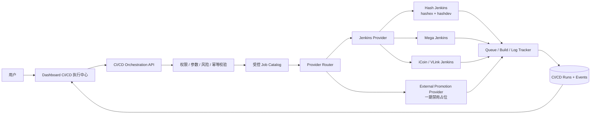
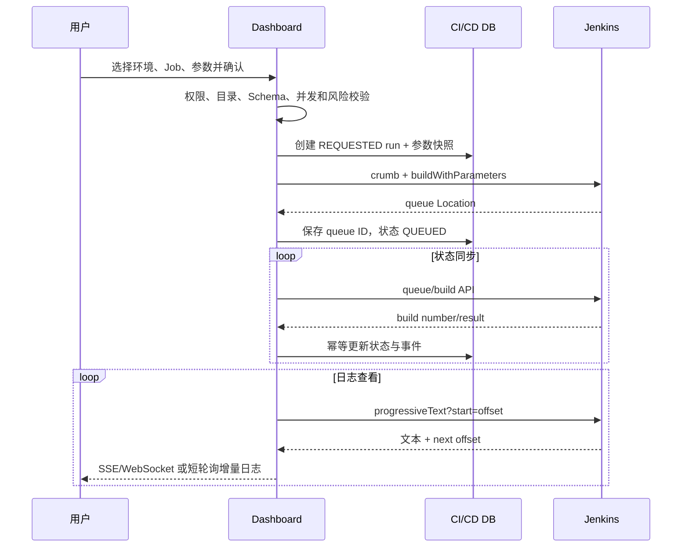

# Dashboard CI/CD Job 编排与执行中心开发计划

> 状态：Phase 0-4 功能已落地；Phase 5 按已接受的外部系统能力边界完成；真实链路验收、自动化覆盖和遗留项见各 Phase 状态
> 日期：2026-10-09
> 适用范围：Dashboard、各环境 Jenkins、业务构建/部署 Job、Jenkins 内制品发布 Job，以及后续外部推包系统

## 1. 结论

该需求可行，推荐在 Dashboard 中新增独立的 **CI/CD 执行中心**，统一承接：

- 按环境选择受控 Jenkins 实例；
- 从受控 Job 目录选择“构建部署”或“制品推包”任务；
- 根据 Job 的参数 Schema 填写参数并进行后端校验；
- 触发 Jenkins 队列并追踪 queue、build、阶段、日志和最终结果；
- 对发布类操作执行权限、确认、审计和并发控制；
- 为后续非 Jenkins 推包系统预留 Provider 接口。

不允许用户输入任意 Jenkins URL、Job 名或任意参数直接执行。Job 必须来自 Dashboard 后端读取到的 Jenkins 远端目录：hashex/hashdev 与 mgbx 展示对应实例的全部可读 Job，icoin 只展示 `^(icoin-|icoinweb)` 范围；用户只能从发现结果中选择。`cicd_job_catalog` 不再是唯一白名单，而是为重点 Job 补充展示名、审批、并发和参数覆盖策略。

一期建议只实现：

1. `hashex`、`hashdev` 共用 Jenkins 实例的执行器配置；
2. Jenkins 内的业务构建部署 Job；
3. Jenkins 内的 Maven/Nexus 推包 Job；
4. 队列、构建状态和日志追踪；
5. 外部推包 Provider 仅保留接口和禁用占位，不接真实系统。

## 2. 当前代码与流水线现状

### 2.1 Dashboard 已有能力

当前“监控资源申请”已经具备一套 Jenkins API 调用基础：

- SiteConf 保存 Jenkins URL、用户名和敏感 API Token；
- 获取 crumb；
- 调用 `buildWithParameters`；
- 从 Jenkins queue URL 解析 queue ID；
- queue -> build number -> build result 状态跟踪；
- 将执行记录和申请审计写入数据库。

这部分代码可以抽取为通用 Jenkins Client，但不应继续复用 `monitoring_jenkins_executions` 表或监控申请状态机。CI/CD 执行属于独立业务域，需要独立的数据、权限和生命周期。

### 2.2 本地 CI/CD 仓库观察

仓库：`/Users/liuzelin/gitlab/ci-cd`

已确认 Job 参数和执行逻辑存在差异：

| 场景 | 示例 Job/生成器 | 已观察参数 |
| --- | --- | --- |
| Hash 后端构建部署 | `services/hash/common/batchCreateJobV3.groovy` | `GIT_BRANCH`、`MEEGLE_ID` |
| Hash 前端构建部署 | `services/hash/common/batchCreateFrontJob.gdsl` | `BRANCH_NAME` |
| Hash Maven/Nexus 推包 | `services/hash/common/publishNexus.groovy` | `BRANCH_NAME` |
| Hashdev Maven/Nexus 推包 | `services/hashdev/common/publishNexus.groovy` | `BRANCH_NAME` |
| 统一流水线 | `jenkins/vars/cicdPipeline.groovy` | 由 Job 配置和参数解析器共同生成上下文 |

因此不能假设所有环境和 Job 都使用同一个 `branch` 参数，也不能由 Dashboard 根据 Job 名猜测参数。

### 2.3 环境与执行器不是一对一

环境和 Jenkins 实例应拆成两个概念：

- `environment`：用户选择的项目环境，例如 `hashex`、`hashdev`、`mega`、`icoin`、`tb`；
- `executor`：实际 Jenkins 系统及其 API 凭据；
- 多个环境可以绑定同一个执行器，例如 `hashex` 与 `hashdev`；
- 同一环境未来可以按操作类型绑定不同 Provider，例如构建部署使用 Jenkins，推包使用外部系统。

### 2.4 Phase 0 真实链路盘点（2026-10-09）

本轮只调用 Jenkins GET API，没有触发构建、取消任务或修改 Jenkins 配置。凭据来自本地安全文件，文档和代码均未记录 Token、Crumb 值或认证头。

| Executor | 目标环境 | Jenkins 版本 | API 身份 | 根级 Job | 只读检查 | 结论 |
| --- | --- | --- | --- | ---: | --- | --- |
| `hash-jenkins` | hashex、hashdev | 2.555.1 | `admin`，含 `admin` authority | 508 | whoAmI、Job、Crumb、Queue、Build metadata、Progressive log 均可读 | hashex/hashdev 确认共用该实例 |
| `mgbx-jenkins` | mgbx | 2.555.1 | `admin`，`authenticated` authority | 137 | 更新凭据后 whoAmI、Job、Crumb、Queue 均可读 | 真实业务前缀是 `mega-` 与 `megaweb`，不是 `mgbx-` |
| `icoin-jenkins` | icoin | 2.492.1 | `mageadmin`，含 `admin` authority | 1075 | whoAmI、Job、Crumb、Queue 均可读 | 同一实例可见多个环境，必须通过 binding 的发现规则隔离 |

目录发现范围由环境 binding 控制，用户不能编辑规则：

| 环境 | 发现规则 | 实测结果 |
| --- | --- | --- |
| hashex | 全部 | Hash Jenkins 全部可读 Job |
| hashdev | 全部 | 与 hashex 共用 Hash Jenkins，展示全部可读 Job |
| mgbx | 全部 | 该 Jenkins 仅承载 mgbx 相关 Job，不再做名称筛选 |
| icoin | `^(icoin-|icoinweb)` | 109 个 Job：107 个后端、2 个前端；未纳入的 3 个 `*-icoin` Job 均为脚本/Job 生成任务 |

Job 必须来自后端实时发现结果，禁止浏览器提交未发现的自由文本名称。后端仍需校验环境、action type、executor、binding 发现范围和远端 Job 存在性；catalog 只提供增强策略，不能扩大 binding 范围。

首批 hashex/hashdev catalog 增强项及实时参数契约：

| 环境 | Action | Job | 参数 |
| --- | --- | --- | --- |
| hashex | `BUILD_DEPLOY` | `hash-kylin-price-kylin-price-impl` | `GIT_BRANCH=saas_test`、可选 `MEEGLE_ID` |
| hashex | `BUILD_DEPLOY` | `hashweb-partner-admin-web-frontend` | `BRANCH_NAME=mega_test` |
| hashex | `PACKAGE_PUBLISH` | `hash-kylin-common-publish` | `BRANCH_NAME=saas_test` |
| hashdev | `BUILD_DEPLOY` | `hashdev-kylin-price-kylin-price-impl` | `GIT_BRANCH=saas_dev` |
| hashdev | `BUILD_DEPLOY` | `hashdevweb-partner-admin-web-frontend` | `BRANCH_NAME=mega_test` |
| hashdev | `PACKAGE_PUBLISH` | `hashdev-kylin-common-publish` | `BRANCH_NAME=saas_dev` |

安全结论：Phase 0 盘点时 hashex、icoin 使用的凭据带管理员权限，mgbx 账号权限范围也需要在写阶段前专项核对。hashex 已于 2026-10-09 创建 `dashboard-cicd-bot` API-only 机器账号，并绑定项目角色 `dashboard-cicd-hashex`；角色可覆盖该 Jenkins 的全部 Job，但仅授予 Read/Discover/Build/Cancel，不授予 Configure、Credentials 或 Overall/Administer。Job 选择范围主要由 Dashboard binding 控制，因此机器 Token 泄露时的影响面大于精确 Jenkins 白名单，这是维护便利性换取的已知风险。

## 3. 推荐架构



核心原则：

1. **环境选择复用全局 `/environments` 数据源。**
2. **执行器与环境分离。** 环境只保存 executor/provider 引用，不重复保存凭据。
3. **Job 目录来自受控发现。** hashex/hashdev、mgbx 可使用全部远端 Job，icoin 使用锚定前缀过滤；用户不能自由输入 Job 名、URL 或 Jenkins 参数。
4. **参数由 Schema 驱动。** 每个 Job 明确允许的参数、类型、默认值、是否敏感、校验规则和展示顺序。
5. **触发与追踪统一，业务语义分离。** Jenkins Client 可复用，但构建部署、制品推包分别有独立 action type。
6. **Dashboard 不持有业务仓库凭据或集群凭据。** 这些仍由 Jenkins Job 内部的受控 Credentials 管理。
7. **不让浏览器直连 Jenkins。** Jenkins Token、crumb、日志 API 全部由后端代理。

## 4. 领域模型

### 4.1 Executor

`cicd_executors` 表示一个真实执行系统：

| 字段 | 说明 |
| --- | --- |
| `executor_key` | 稳定标识，例如 `hash-jenkins` |
| `provider_type` | 一期 `JENKINS`；预留 `EXTERNAL_PROMOTION` |
| `display_name` | 页面名称 |
| `base_url_conf_key` | SiteConf 中 URL 的 key |
| `username_conf_key` | SiteConf 中用户名的 key |
| `token_conf_key` | SiteConf 中敏感 Token 的 key |
| `enabled` | 是否允许新建执行 |
| `read_only` | 是否仅允许查询历史 |

执行器表只引用 SiteConf key，不保存明文 Token。敏感字段继续使用 SiteConf 的加密/脱敏能力。

### 4.2 Environment binding

`cicd_environment_bindings`：

| 字段 | 说明 |
| --- | --- |
| `environment_id` | 必须存在于全局 `/environments` |
| `action_type` | `BUILD_DEPLOY` 或 `PACKAGE_PUBLISH` |
| `provider_type` | `JENKINS` / `EXTERNAL_PROMOTION` |
| `executor_key` | 绑定执行器；外部 Provider 可为空或绑定其他配置 |
| `enabled` | 当前环境是否开放该动作 |

这样可以表达：

- `hashex`、`hashdev` 的 `BUILD_DEPLOY` 都指向 `hash-jenkins`；
- 某环境的 `PACKAGE_PUBLISH` 指向 Jenkins；
- 另一环境的 `PACKAGE_PUBLISH` 指向尚未实现的外部 Provider，并在页面显示“暂未接入”。

### 4.3 Job catalog

`cicd_job_catalog` 用于重点 Job 的增强策略；未登记 Job 仍可在 binding 允许的发现范围内展示：

| 字段 | 说明 |
| --- | --- |
| `job_key` | Dashboard 内部稳定 ID |
| `environment_id` | 所属环境 |
| `action_type` | 构建部署或制品推包 |
| `executor_key` | 使用的 Jenkins |
| `jenkins_job_full_name` | Jenkins 完整路径，支持 folder/job |
| `display_name` | 用户可读名称 |
| `service_key` | 服务或公共包标识 |
| `parameter_schema_json` | 受控参数 Schema |
| `enabled` | 是否允许新执行 |
| `requires_approval` | 是否需要审批 |
| `concurrency_policy` | `ALLOW` / `FORBID_SAME_JOB` / `FORBID_SAME_SERVICE` |

示例参数 Schema：

```json
{
  "version": 1,
  "parameters": [
    {
      "name": "GIT_BRANCH",
      "type": "git_branch",
      "required": true,
      "default": "saas_test",
      "pattern": "^[A-Za-z0-9._/-]{1,128}$"
    },
    {
      "name": "MEEGLE_ID",
      "type": "string",
      "required": false,
      "maxLength": 128
    }
  ]
}
```

一期 Schema 类型建议只支持：`string`、`boolean`、`enum`、`git_branch`。不允许密码、Token、任意文件上传或自由 JSON 参数。

### 4.4 Run 与事件

`cicd_runs` 保存一次不可变的执行快照：

- run ID、action type、environment ID；
- executor/provider、Job key、Jenkins Job full name；
- 参数快照（敏感参数不得存储）；
- 请求人、审批人、确认说明；
- queue ID、build number、build URL；
- `QUEUED`、`RUNNING`、`SUCCESS`、`FAILURE`、`ABORTED`、`CANCELLED`、`UNKNOWN`；
- Jenkins result、开始/结束时间、最后同步时间；
- 错误分类和用户可读错误摘要。

`cicd_run_events` 保存状态变化、触发、审批、取消、重试、Provider 错误等审计事件。

日志不建议无限写入数据库。数据库只保存：

- 最后读取 offset；
- 最近错误摘要；
- 可选的有限尾部日志；
- Jenkins build URL。

完整日志以 Jenkins 为准，Dashboard 使用 progressive log API 按 offset 拉取并流式展示。

## 5. Jenkins Provider 设计

### 5.1 通用 Jenkins Client

从当前监控申请服务中抽取独立 Client：

- `getCrumb(executor)`；
- `triggerBuild(executor, jobFullName, parameters, idempotencyKey)`；
- `getQueueItem(executor, queueId)`；
- `getBuild(executor, jobFullName, buildNumber)`；
- `getProgressiveLog(executor, jobFullName, buildNumber, start)`；
- `stopBuild(...)`，一期可暂不开放 UI；
- 统一处理 401、403、404、302/OIDC 重定向、超时和 Jenkins 非 JSON 错误页。

Job full name 必须按 Jenkins folder 逐段编码，不能把整个字符串只做一次普通 URL 编码。

### 5.2 触发流程



### 5.3 幂等和并发

- 浏览器提交时生成 `client_request_id`；数据库唯一约束防止双击重复触发。
- 在拿到 Jenkins queue ID 前保持 `TRIGGERING`，网络结果未知时不得直接重试创建第二次构建。
- 结果未知时先按 Jenkins queue/build cause 中的 Dashboard run ID 对账。
- 默认禁止相同环境、相同 Job 在已有 `QUEUED/RUNNING` 时重复执行；确需并发的 Job 单独放开。
- “重新执行”创建新 run，并通过 `retry_of_run_id` 关联原记录，不能覆盖原审计。

### 5.4 日志安全

- 后端限制单次读取大小、总速率和最大并发连接；
- 对常见 Token、Authorization、密码和 Jenkins Credentials 输出进行脱敏；
- 日志作为不可信文本展示，禁止渲染 HTML；
- Jenkins URL 只返回允许用户访问的 build 页面地址，不返回 API Token；
- 失败信息区分连接失败、身份验证失败、无 Job 权限、参数错误、排队取消和构建失败。

## 6. 权限与风险控制

建议新增权限：

| 权限 | 用途 |
| --- | --- |
| `menu:cicd-runs` | 查看 CI/CD 执行中心 |
| `cicd-runs:execute-build` | 发起构建部署 |
| `cicd-runs:execute-publish` | 发起制品推包 |
| `cicd-runs:approve` | 后续增强占位：审批需要审批的任务（当前尚未实现） |
| `cicd-runs:view-all` | 查看其他用户的执行 |
| `cicd-runs:cancel` | 取消排队或运行中的构建 |
| `cicd-config:manage` | 管理执行器绑定与 Job Catalog |

建议风险规则：

- 构建部署和制品推包分开授权；
- 后续接入正式审批时，生产环境默认需要非申请人审批；
- 后续审批状态机必须禁止申请人审批自己的请求，审批通过后签发一次性、有限时效的执行授权，不直接自动发布；
- 推包到正式 Maven/Nexus 仓库默认需要确认说明；
- 一期不接受自由文本 Job、任意参数和“重放原始 HTTP 请求”；Job 必须来自后端实时发现目录；
- 可选的 MFA 应放在高风险审批/执行确认处，而不是普通日志查看处；
- 所有状态变化写审计事件，保留环境、Job、参数摘要、操作者和 Jenkins build URL。

## 7. 前端体验

建议新增菜单：**运维工具 / CI/CD 执行中心**。

页面分为三个区域：

1. **新建执行**
   - 环境选择器：与左上角和 SSL 证书页面使用同一份 `/environments` 数据；
   - 操作类型：构建部署 / 制品推包；
   - Job：可输入搜索、模糊匹配的受控下拉框；
   - 参数：根据 Schema 动态生成，切换环境或 Job 时清空下游参数；
   - 提交前确认：环境、Jenkins、Job、参数、风险级别和是否审批。

2. **运行列表**
   - 环境、类型、Job、服务、申请人、状态、队列/构建编号、耗时；
   - 默认只显示本人，可按权限查看全部；
   - 文本搜索必须手动点击或回车触发，避免输入时连续请求。

3. **运行详情**
   - 状态时间线；
   - 参数快照；
   - Jenkins queue/build 链接；
   - 增量日志查看；
   - 失败摘要；
   - 受控的取消或重新执行入口。

当环境没有对应 action binding 时，不隐藏环境，而是显示：

- “该环境尚未接入构建部署执行器”；或
- “该环境的推包由外部系统执行，Dashboard 暂未接入”。

并阻断选择 Job 和提交。

## 8. Provider 扩展边界

定义统一接口，避免把外部推包系统伪装成 Jenkins Job：

```ts
interface CicdExecutionProvider {
  validateConfiguration(binding: EnvironmentBinding): Promise<void>;
  trigger(run: CicdRun, parameters: Record<string, unknown>): Promise<TriggerResult>;
  refresh(run: CicdRun): Promise<ProviderRunStatus>;
  readLog(run: CicdRun, cursor?: string): Promise<LogChunk>;
  cancel?(run: CicdRun): Promise<CancelResult>;
}
```

一期实现 `JenkinsExecutionProvider`。`ExternalPromotionProvider` 只返回明确的 `NOT_IMPLEMENTED`/禁用状态；后续接入真实外部 API 时，不需要改变前端运行状态模型。

## 9. 分阶段开发计划

### Phase 0：真实链路盘点与契约固化

- 列出所有环境及其 Jenkins URL、认证方式、是否与其他环境共享；
- 盘点构建部署和 Jenkins 推包 Job 的完整名称、参数定义、默认值和权限；
- 确认 Jenkins API Token 是否为稳定机器身份，避免绑定个人 OIDC 生命周期；
- 核查 crumb、queue、build、progressive log API；
- 确认生产环境审批要求和允许取消的范围；
- 形成首批 hashex/hashdev catalog 增强项，并确认各环境发现范围。

验收：每个首批 Job 都有环境、执行器、action type、参数 Schema、权限和测试证据，且没有占位 Job 名或参数。

- **功能完成：** 已完成 hashex/hashdev、mgbx、icoin、tb 的 Jenkins、机器身份、Job 范围与参数契约盘点。
- **人工验收状态：** whoAmI、crumb、queue、Job 读取和权限范围均已按环境验证；Phase 0 不触发业务 Job。
- **已接受边界：** 目录发现按 binding 控制；hashex/hashdev、mgbx、tb 展示对应 Jenkins 全部 Job，icoin 使用锚定前缀过滤。
- **遗留项：** 正式审批状态机作为后续增强占位；当前由独立执行权限与明确确认承担风险控制，不阻塞现阶段验收。

### Phase 1：只读目录与连接诊断

- 新增 executor、environment binding、Job catalog 数据模型；
- SiteConf 增加每个 Jenkins 执行器的敏感配置；
- 后端提供环境、动作、Job 查询 API；
- 管理端提供“连接检查”和“Job/参数对账”，但不触发构建；
- 页面完成环境、动作、Job 受控选择和缺失配置提示。

验收：Dashboard 能准确展示各 binding 允许的远端 Job；选中 Job 后读取真实参数。未在远端发现或不满足 icoin 前缀规则的 Job 不可执行。

- **功能完成：** executor、environment binding、catalog、敏感 SiteConf、连接诊断和参数对账均已落地。
- **人工验收状态：** 四套 Jenkins 的目录与参数读取已验证，未发现或越过环境过滤规则的 Job 会被后端拒绝。
- **已接受边界：** catalog 是展示、审批和并发策略增强，不是唯一 Job 白名单；最终范围由环境 binding 与远端发现共同决定。
- **遗留项：** Jenkins 请求逻辑仍分布在 catalog 与 runs service，尚未抽取成单一通用 Jenkins Client。

当前实现（2026-10-09）：

- 新增 `cicd_executors`、`cicd_environment_bindings`、`cicd_job_catalog`，迁移可重复执行；
- hashex/hashdev、mgbx、icoin 已建立 executor/binding；前三者采用全部 Job，icoin 使用 `^(icoin-|icoinweb)`；
- 首批六个 hashex/hashdev Job 已录入 catalog 作为增强策略；页面 Job 选择来自实时 Jenkins 目录；
- 新增独立 `cicd.*` 敏感 SiteConf，不复用监控申请的 Jenkins 配置；支持 SiteConf 优先、运行时环境变量兜底；
- 后端仅提供 bindings、executors、jobs、diagnostics、reconciliation 五类 GET API，没有构建触发接口；
- 新增“运维工具 / CI/CD 执行中心”页面，复用全局环境选择器，支持受控 Job 模糊匹配、连接检查和参数对账；
- 连接检查和对账要求 `cicd-config:manage`，普通目录查看要求 `menu:cicd-runs`；迁移默认授权给 admin 角色；
- 本地数据库迁移已应用并二次执行验证幂等：3 个 executor、8 个 binding、6 个 catalog Job、2 个权限；
- Phase 0 使用的管理员 Token 没有写入 SiteConf。hashex 已改用 `dashboard-cicd-bot` 专用 API Token并写入敏感 SiteConf；机器账号可读取全部 Job，但只有 Read/Discover/Build/Cancel 权限，whoAmI、Crumb、Queue 均验证通过。
- MGBX、iCoin 也已创建同名专用机器账号并写入各自敏感 SiteConf。MGBX 可见 137 个 Job；iCoin 的 Jenkins 项目角色只允许 `^(icoin-|icoinweb).*$`，实测 109 个匹配 Job 具备 Read/Build/Cancel，非匹配 Job 无上述权限。

### Phase 2：Hashex/Hashdev Jenkins 构建部署

- 抽取通用 Jenkins Client；
- 新增 run/event 表和权限；
- 实现触发、queue/build 状态同步、运行列表和详情；
- 实现 progressive logs；
- 实现幂等、防双击和同 Job 并发策略；
- 先接少量后端/前端试点 Job。

验收：从 Dashboard 触发一次受控试点构建，queue、build number、日志、结果、耗时和 Jenkins URL 全链路一致；重复提交不会产生两次构建。

- **功能完成：** 触发、queue/build 同步、后台自动追踪、WebSocket 日志、取消、`clientRequestId` 幂等和同 Job 并发阻断已实现。
- **人工验收状态：** 用户已反馈真实 Jenkins 构建链路测试通过；仓库不保存真实业务构建的 queue/build/log 内容，后续仍以 Jenkins 审计记录为准。
- **已接受边界：** 自动化测试只使用 mock，不触发真实业务 Job；真实 Jenkins 身份、构建和产物验证保留为人工验收。
- **遗留项：** 通用 Jenkins Client、独立运行详情页和重新执行关联模型作为后续架构与体验增强；完整错误分类仍可继续从 ServiceUnavailable 文案演进为结构化错误码，不阻塞当前构建链路验收。

当前实现（2026-10-10）：

- 新增 `cicd_runs`、`cicd_run_events` 和构建执行、推包执行、取消三项独立权限；迁移已在本地数据库连续执行两次验证幂等；
- Job 在触发前重新从 Jenkins 读取 `buildable` 和参数定义，拒绝未声明参数、非法 choice、非标量值以及超长值；
- 使用 `clientRequestId` 防止前端重复提交，并阻止同环境、同执行器、同 Job 的活跃任务并发；
- 支持 crumb、`buildWithParameters`/`build`、queue 到 build number、构建结果、progressive log 和 queue/build 取消；
- 页面基于真实 Jenkins 参数渲染表单，提供执行记录、人工刷新、日志查看和取消入口；
- 自动化测试不会触发业务 Job。用户已反馈首次真实构建链路测试通过；后续发布仍需操作者在页面核对环境、Job 和参数，并以 Jenkins queue/build/log 作为真实执行审计依据。

### Phase 3：Jenkins 内制品推包

- 增加 `PACKAGE_PUBLISH` action type 和独立权限；
- 为 Hash/Hashdev 推包 Job 增加 catalog 风险策略；正式申请审批状态机保留为后续增强占位；
- 根据 Job Schema 使用 `BRANCH_NAME` 等真实参数；
- 增加正式仓库确认说明；审批策略暂以独立权限和固定确认短语实现；
- 列表和详情明确区分“构建部署”和“制品推包”。

当前范围验收：试点公共包能够通过独立发布权限和固定确认短语触发受控 Jenkins 推包；Dashboard 的 queue、build、日志和最终结果与 Jenkins 一致，Nexus 产物版本由人工核对。正式“申请 → 非申请人审批 → 一次性执行授权 → 再次确认发布”状态机为后续增强，不作为当前 Phase 3 验收阻塞。

- **功能完成：** `PACKAGE_PUBLISH` 独立权限、固定确认短语、运行状态、日志、取消和审计复用已完成。
- **人工验收状态：** 用户已反馈 Jenkins 推包链路测试通过；Nexus 产物版本仍由人工到仓库侧核对。
- **已接受边界：** 当前使用“权限 + 明确确认”控制发布风险，不把制品仓库凭据或任意参数暴露给 Dashboard 用户；正式审批已明确延期为后续增强。
- **遗留项：** `requires_approval`、`cicd-runs:approve` 和非申请人审批状态机目前仅保留模型/权限设计占位；Nexus 目标产物仍由人工核对。

当前实现（2026-10-10）：

- `PACKAGE_PUBLISH` 使用独立的 `cicd-runs:execute-publish` 权限；
- 触发前显示高风险提示，并要求输入固定确认短语“确认推包”；
- 推包复用相同的运行状态、幂等、并发、日志和取消模型，但在页面和记录中与构建部署明确区分；
- 尚未自动校验 Nexus 产物；用户已反馈真实推包链路测试通过，后续仍按本节当前验收条件人工核对目标仓库产物。

### Phase 4：多 Jenkins 环境

- 逐个接入 Mega、iCoin、VLink 等 Jenkins 执行器；
- 每个环境独立验证 API 身份、Job 发现范围、参数 Schema 和日志；
- 不复制前端页面逻辑，只新增 executor/binding/catalog 数据。

验收：切换环境后只能看到该环境允许的 Job；请求不会发送到其他环境 Jenkins。

- **功能完成：** hashex/hashdev、mgbx、icoin、tb 已通过独立 executor/binding 接入同一页面与后端路由。
- **人工验收状态：** 各 Jenkins 的身份、crumb、queue、目录范围与 Build/Cancel 权限已验证；TB 可见 121 个 Job。
- **已接受边界：** hashex/hashdev、mgbx、tb 不做名称过滤；icoin 同时使用 Dashboard 正则和 Jenkins 项目角色限制。
- **遗留项：** 暂无功能阻塞；新增环境时仍需人工完成机器账号、SiteConf、binding 与真实链路验收。

当前实现（2026-10-10）：

- Hashex/Hashdev、MGBX、iCoin 已分别绑定独立执行器；MGBX 与 iCoin 使用专用机器账号，并完成身份、crumb、queue、Job 范围和 Build/Cancel 权限验证；
- iCoin 继续使用 `^(icoin-|icoinweb)` 服务端过滤和 Jenkins 项目角色双重限制；MGBX 使用该 Jenkins 的全部 Job；
- VLink 对应 Dashboard 实际环境 ID 为 `tb`。已新增并启用 `tb-jenkins` 执行器、SiteConf 配置和 `tb` 环境的构建部署/制品推包绑定，旧的错误 `vlink` 占位会由迁移清理；
- TB Jenkins 已创建 `dashboard-cicd-bot` 专用机器账号和独立 Token，whoAmI/root/crumb/queue 均返回 200，可见 121 个 Job；管理员 Token 未写入 SiteConf；
- TB Jenkins 已从 `FullControlOnceLoggedInAuthorizationStrategy` 切换为 `RoleBasedAuthorizationStrategy`，复用既有 `role-strategy` 插件，无需安装插件或重启。`admin` 仅绑定 `jenkins-admin` 管理角色；`dashboard-cicd-bot` 仅绑定覆盖全部 TB Job 的 `dashboard-cicd-tb` 角色，权限限定为 Overall Read、View Read、Job Discover/Read/Build/Cancel，不包含 Configure、Credentials 或 Administer。切换后验证管理员可见 121 个 Job，机器账号对 121 个 Job 均具备受控权限且匿名 API 返回 403；Dashboard 继续按环境 binding 路由，TB 不做 Job 名称筛选。

### Phase 5：外部推包 Provider

- 根据真实系统 API 设计认证、任务 ID、状态和日志适配；
- 实现 `ExternalPromotionProvider`；
- 沿用现有 run/event/approval 模型；
- 做跨系统幂等、回调验签或轮询退避。

验收：外部任务 ID、状态、日志和 Dashboard run 一一对应，未知结果不会被误判成功。

- **功能完成：** `icoin + IMAGE_BUILD_PUBLISH` 的目录读取、受控参数、异步 Worker、幂等、串行领取和结果落库已完成。
- **人工验收状态：** 用户已反馈外部现货推包链路测试通过；目录只读验证得到 26 个服务和 1 个 Registry。
- **已接受边界：** 当前外部系统没有任务 ID、状态、日志、取消或回调 API；未知响应严格落为 `UNKNOWN`，不自动重试、不误判成功。本轮不改造该外部系统。
- **遗留项：** 完整异步 Provider 能力列入未来升级项，不作为当前 Phase 5 已接受范围的阻塞条件。

当前实现（2026-10-10）：

- 首个 Provider 为 `EXTERNAL_SPOT_PUBLISH`，绑定 `icoin + IMAGE_BUILD_PUBLISH`，与 Jenkins 的 Maven/Nexus `PACKAGE_PUBLISH` 明确区分；
- Dashboard 后端使用敏感 SiteConf 中的登录地址、账号和密码调用 `/signin`，解析真实 HTML 服务目录；前端只能选择目录中的服务、Registry 和受格式限制的 Git Ref，不能修改 repo；
- 当前线上目录只读验证成功：HTTP 200，解析出 26 个可用服务和 1 个 Registry；
- 触发操作先写入 `cicd_runs` 和 `cicd_external_tasks`，后台 Worker 串行领取任务，再调用外部 `/build`；浏览器请求不等待长时间构建；
- 本地 UUID 提供防双击幂等；同服务存在 `QUEUED/RUNNING/UNKNOWN` 时禁止再次触发；
- 外部系统不提供任务 ID、状态查询、日志或取消接口。因此网络超时、Dashboard Worker 中断和无法识别的响应一律标记 `UNKNOWN`，不自动重试；页面明确显示无实时日志且禁用取消；
- 成功时保存并展示外部系统返回的镜像 Tag。账号、密码和 repo 不返回浏览器，也不写入运行参数；
- 已接受当前外部系统的能力边界，本阶段不修改其代码和安全机制。

未来若要升级为完整异步 Provider，仍需要：

1. 外部系统基础 URL、测试环境和稳定机器身份认证方式；
2. 创建推包任务的请求/响应示例，以及业务幂等键；
3. 环境、项目、分支、版本、目标仓库等参数定义和服务端校验规则；
4. 任务状态枚举、查询和日志 API，以及失败、未知、超时、取消语义；
5. 回调签名协议，或允许的轮询频率、超时和退避规则；
6. 哪些 Dashboard 环境的 `PACKAGE_PUBLISH` 应切换到外部 Provider，以及审批负责人。

后端已增加 Provider 类型保护：非 `JENKINS` 绑定会明确返回“尚未实现执行适配器”，不会误用 Jenkins Client 发起请求。

## 10. 测试策略

### 自动化测试

当前 CI/CD 自动化测试共 6 个 Suite、34 个用例，全部使用 mock，不触发真实 Jenkins Job 或外部推包。

- **已覆盖：** 参数 Schema、未知参数、默认值、choice、标量与长度校验；
- **已覆盖：** 环境 Job 前缀规则、Job folder 分段编码与路径穿越拒绝；
- **已覆盖：** Jenkins 401/403/404/500、crumb 失败、queue 响应缺失和取消失败；
- **已覆盖：** 重复 `clientRequestId`、同 Job 活跃任务并发阻断、queue -> build -> success 状态机；
- **已覆盖：** progressive log cursor、WebSocket 身份与日志分段、日志脱敏和 ConsoleNote 清理；
- **已覆盖：** 后台 reconciler 分布式锁与事件去重；
- **已覆盖：** 当前外部 Provider 的目录解析/缓存、Worker 成功落库和异常转 `UNKNOWN`；
- **部分覆盖：** executor/provider 路由由 Service 测试覆盖关键分支，尚无真实数据库集成测试；
- **待后续：** 浏览器组件自动化、真实 Jenkins 超时/302 差异；非申请人审批/禁止自审和未来完整异步 Provider contract tests 均属于已明确延期的增强项。

### 真实链路测试

仅以下内容需要人工真实验证：

- 首个 Jenkins 机器身份能否访问目标 Job；
- crumb 与 `buildWithParameters`；
- queue/build/log API 的真实响应差异；
- 一次试点构建部署和一次试点 Nexus 推包；
- Jenkins 与 Dashboard 最终状态、日志、参数和产物一致。

## 11. 明确不做

一期不做：

- 任意 Jenkins Job 浏览和执行；
- 用户自由填写 Jenkins URL、Token 或 Job 名；
- 将 Jenkins Token 返回浏览器；
- 直接在 Dashboard 执行 shell、kubectl、docker 或 Maven；
- 将外部推包流程硬编码成 Jenkins Job；
- 自动猜测不同 Job 的参数；
- 无限保存完整 Jenkins 控制台日志；
- 一次性开放所有环境和所有 Job。

## 12. 开发前必须补齐的信息

进入 Phase 1 前，需要确认并形成配置清单：

1. 每个环境对应的 Jenkins 实例，以及 hashex/hashdev 共用实例的准确 executor key；
2. 每个 Jenkins 的稳定机器身份和最小 Job 权限；
3. 首批构建部署 Job 的完整名称及参数；
4. 首批 Jenkins 推包 Job 的完整名称及参数；
5. 哪些环境需要审批、谁可审批、是否允许申请人取消；
6. Jenkins folder 结构和 Job URL；
7. 外部推包环境的占位文案和后续系统负责人。

完成上述清单后，建议从 `hashex/hashdev + 2 个构建 Job + 1 个 publish Job` 开始，而不是直接接入全部 Jenkins。
